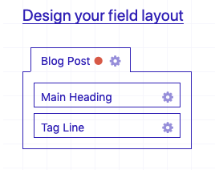
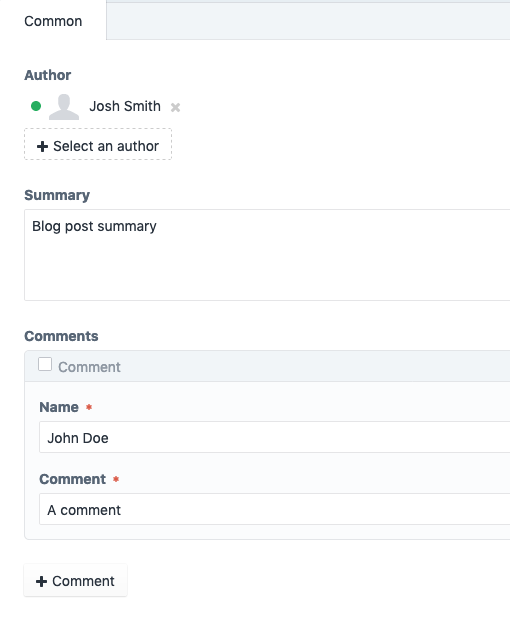
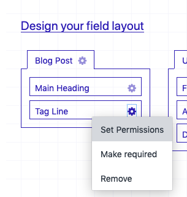
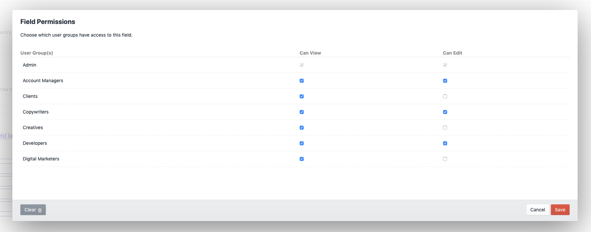
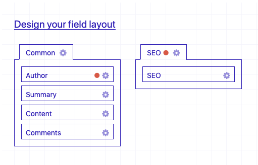
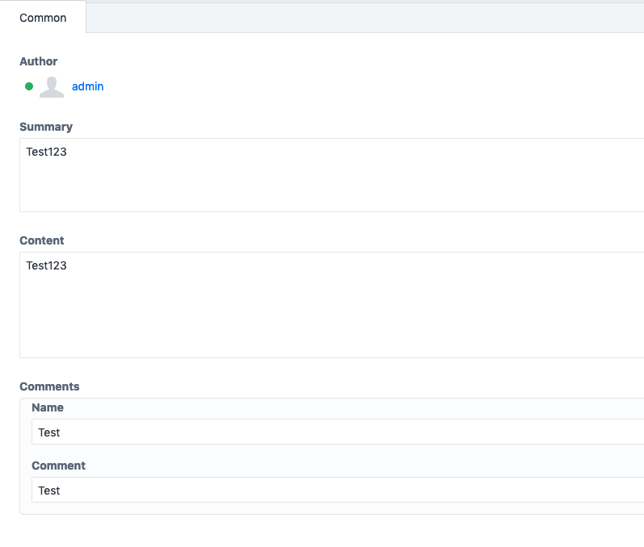
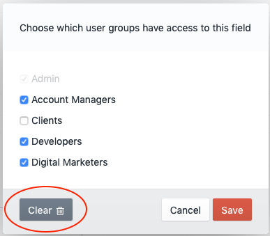

# Field and Tab Permissions plugin for Craft CMS 3.5

A plugin that allows you to set field and tab visibility for particular user groups in the CMS.

## Requirements

This plugin requires Craft CMS 3.5 or later.

## Installation

To install the plugin, follow these instructions.

1. Open your terminal and go to your Craft project:

        cd /path/to/project

2. Then tell Composer to load the plugin:

        composer require thejoshsmith/craft-fab-permissions

3. In the Control Panel, go to Settings → Plugins and click the “Install” button for FAB Permissions.

4. **Important** - Override the Craft Fields Service with the FAB Permissions Fields Service in `config/app.web.php`:

		return [
			'components' => [
				'fields' => [
					'class' => 'thejoshsmith\fabpermissions\services\Fields'
				]
			]
		]

## FAB Permissions Overview

This plugin allows you to restrict access to certain user groups on a per tab or field basis.

**NEW** - Read only access can now be set on fields.

A use case for this would be if you had an SEO tab that only digital marketers and developers should be able to access. You can turn off access to client users whilst keeping access for the marketers and developers—The SEO tab will remain hidden to clients but visible for marketers and developers.

You can alter permissions for any element that uses the core field layout designer. This includes, but isn't limited to:

+ Entry Types
+ Globals
+ Users
+ Assets
+ Categories
+ Tags

## How does it work?

The plugin extends the core field and layout designer javascript object, and injects hidden inputs with user group permissons. Once permissions are saved in the database, an extended fields service is able to filter out fields and tabs based on the logged in user and their access.

Great care has been taken to ensure the bare minimum of core functionality has been extended. You are required to override the base Craft Fields Service with the FAB Permissions Fields Service within your config/app.php file. Until recently this was automatically done, but since plugins are registered after the Project Config listeners, we need to ensure the FAB Permissions Fields Service is loaded at an earlier point, and the only way to do this is to manually override Craft's Fields Service in your app config.

## Using FAB Permissions

1. After installing the plugin, a new menu item will be available from the settings menu on any field layout:

2. Clicking the menu item will bring up the permissions modal. Check the user groups you'd like to give access to, and click save. In this screenshot, Clients won't be able to access the SEO tab.

3. A red dot is now shown in the tab, indicating permissions have been set.

4. Clients no longer have access to the SEO tab.

5. Fields can be restricted in the same way:

_In this screenshot, the author user picker and matrix are set to read-only._

6. Permissions can be cleared using the "Clear" button on the permissions modal:

## FAB Permissions Roadmap

Some things to do, and ideas for potential features:

* Page that shows permissions set across all tabs/fields in the CMS
* Ability to set permissions on an individual user basis.

Brought to you by [Josh Smith](https://joshsmith.dev)
